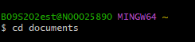
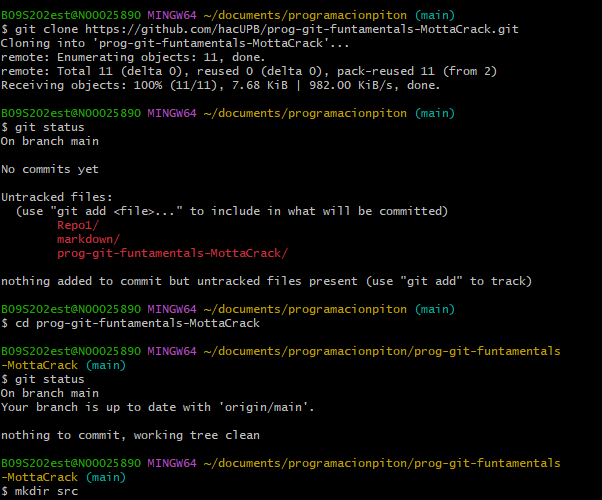
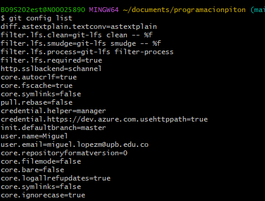
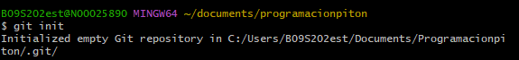
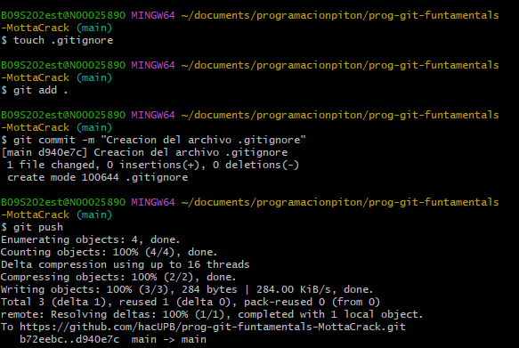

# **Aprendizaje del uso de la consola**

La consola sirve para moverse y trabajar con los directorios del equipo sin usar una interfaz visual, solo codigo.

Aqui hay algunos ejemplos de comandos usados en la consola:

**Cambiar directorio:**

**Clonar repositorio remoto y verificar:**

**Informacion de la sesion actual:**

**Iniciar repositorio:**

**Proceso para un "Push"**

